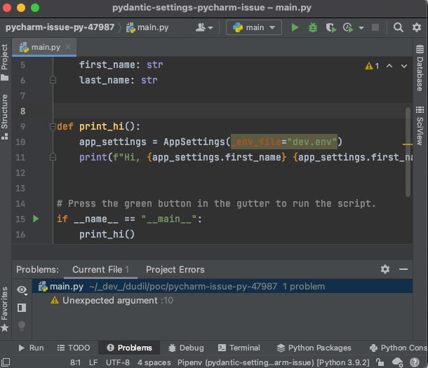
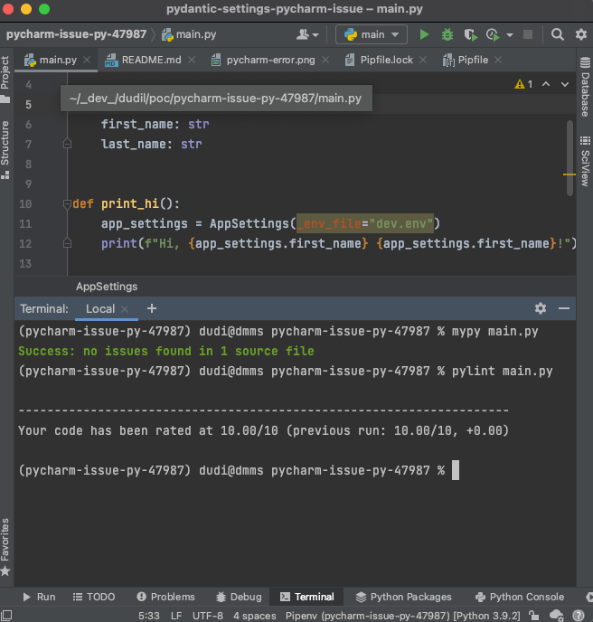

## pycharm-issue-py-47987

This is a sample repository for reflecting issue [PY-47987](https://youtrack.jetbrains.com/issue/PY-47987)  
_Unexpected Argument False Positive - With Pydantic BaseSettings "\_env_file" arguments_

This repository includes everything related to the issue and once cloned should be run _as is_.

Image of PyCharm Error for Issue

Image of PyLint and MyPy not showing any error

